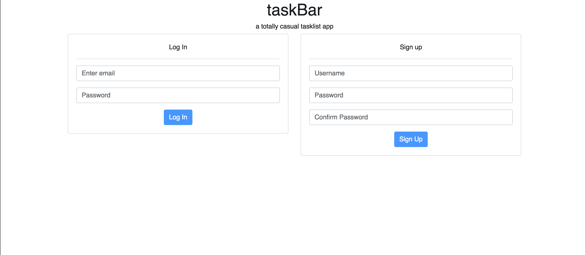
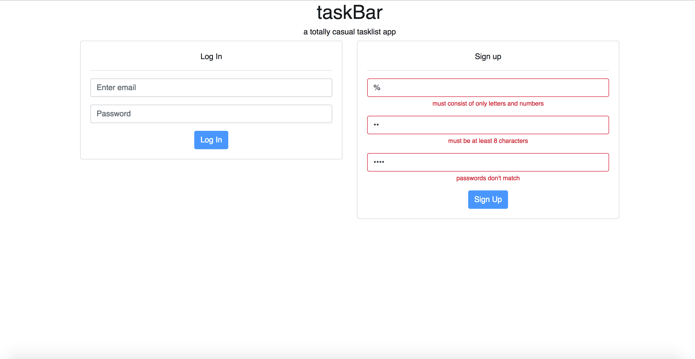
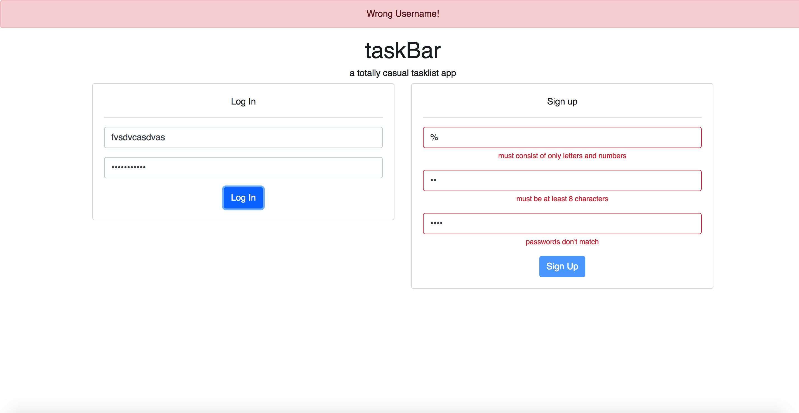
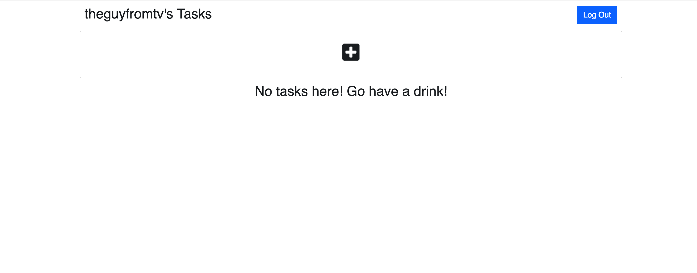
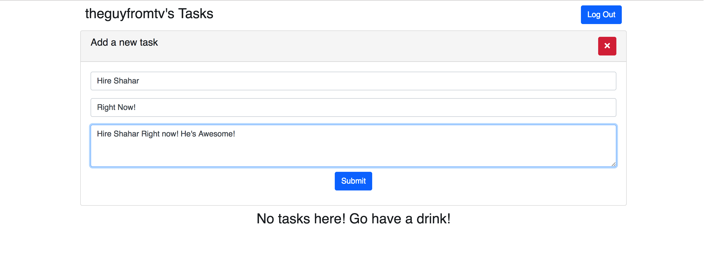
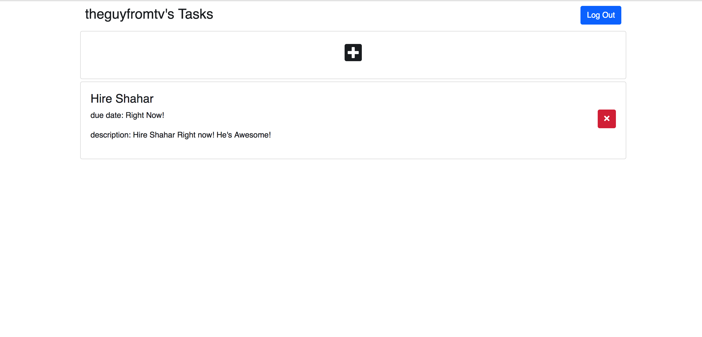

# taskBar

taskBar is a basic tasklist app with authentication

Technologies: MERN stack
Mongoose- ORM
Bcrypt- password hashing
Express-sessions- sessions
Axios- ajax calls
Bootstrap- CSS

taskBar also uses the new React context API to keep up with validation throughout the app

##Instructions

clone or download this repo, then

```
npm i
cd client
npm i
npm start
```
then open a new terminal window from the root of the repo

```
node server.js
```
then in a new terminal window (in your default location)

```
mongod
```
Lastly, you must create a ".env" file at the root folder of the app and add in a SECRET like this (use any string you like):

```
SECRET= 'Victorias'
```

please note these instructions assume you have npm, node, and mongodb installed globally on your machine

## Screenshots

##Authentication page

Default state


Sign up form validation


Errors


##Tasks page

No tasks


Task creation


With tasks



## Notes

This was a super fun exercise! 

email me if you have any questions: goldfinger@goldfinger.ninja

